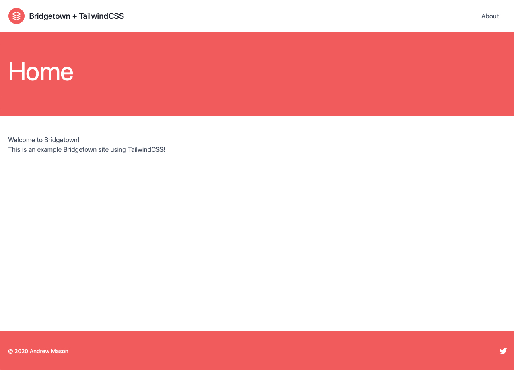
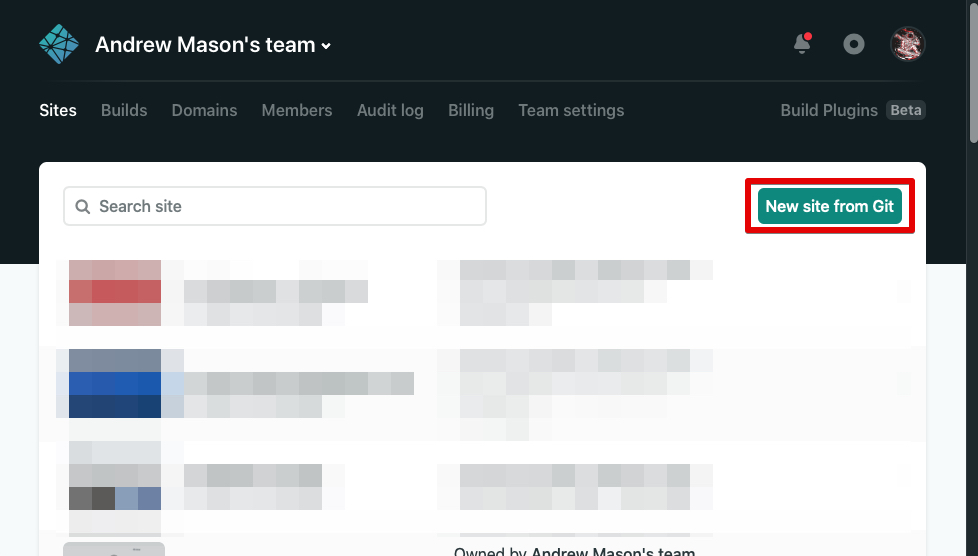

## Instructions

### Prerequisites

Make sure you have Ruby, Bundler, Node, and Yarn installed. These are the versions I am using:

```sh
➜ ruby -v
ruby 2.6.6p146 (2020-03-31 revision 67876) [x86_64-darwin19]

➜ bundler -v
Bundler version 2.1.4

➜ node -v
v13.11.0

➜ yarn -v
1.22.4
```

### Install Bridgetown

```sh
gem install bridgetown -N
```

### Create new project

```sh
bridgetown new bridgetown_tailwind
cd bridgetown_tailwind
yarn start
```

You can now view your site live at http://localhost:4000/

### Tailwind

Let's add TailwindCSS to our new site:

```sh
yarn add -D tailwindcss postcss-import postcss-loader
./node_modules/.bin/tailwind init
```

This will create a `tailwind.config.js` file at the root of our directory.

We will want to run PurgeCSS on our files, so update `tailwind.config.js` to be:

```js
module.exports = {
  purge: {
    enabled: true,
    content: ['./src/**/*.html'],
  },
  theme: {
    extend: {},
  },
  variants: {},
  plugins: [],
}
```

Next, we need to update our Webpack config file to use PostCSS.

In `webpack.config.js`, change:

```js
{
  test: /\.(s[ac]|c)ss$/,
  use: [
    MiniCssExtractPlugin.loader,
    "css-loader",
    {
      loader: "sass-loader",
      options: {
        sassOptions: {
          includePaths: [
            path.resolve(__dirname, "src/_components"),
            path.resolve(__dirname, "src/_includes"),
          ],
        },
      },
    },
  ],
},
```

to:

```js
{
  test: /\.(s[ac]|c)ss$/,
  use: [
    MiniCssExtractPlugin.loader,
    "css-loader",
    {
      loader: "sass-loader",
      options: {
        sassOptions: {
          includePaths: [
            path.resolve(__dirname, "src/_components"),
            path.resolve(__dirname, "src/_includes"),
          ],
        },
      },
    },
    {
      loader: "postcss-loader",
      options: {
        ident: "postcss",
        plugins: [
          require("postcss-import"),
          require("tailwindcss"),
          require("autoprefixer"),
        ],
      },
    },
  ],
},
```

Lastly, we need to import Tailwind into our stylesheet.

Open `./frontend/styles/index.scss` and replace the default styles with:

```css
@import 'tailwindcss/base';
@import 'tailwindcss/components';
@import 'tailwindcss/utilities';
```

If we run `yarn start` again, we should see Tailwind styles being applied!

### Update styles

This step is optional but we can update some of our styles if we want.

Here is what I did:

```html
<!-- src/_layouts/home.html -->
---
layout: default
---

<h1 class="mb-4 text-6xl text-white">Home Page</h1>

<div class="text-2xl text-center text-gray-100">
  {{ content }}
</div>
```

```html
<!-- src/_includes/navbar.html -->

<header class="text-gray-700 body-font">
  <div class="container flex flex-col flex-wrap items-center p-5 mx-auto md:flex-row">
    <a class="flex items-center mb-4 font-medium text-gray-900 title-font md:mb-0" href="/">
      <svg xmlns="http://www.w3.org/2000/svg" fill="none" stroke="currentColor" stroke-linecap="round" stroke-linejoin="round" stroke-width="2" class="w-10 h-10 p-2 text-white bg-red-500 rounded-full" viewBox="0 0 24 24">
        <path d="M12 2L2 7l10 5 10-5-10-5zM2 17l10 5 10-5M2 12l10 5 10-5"></path>
      </svg>
      <span class="ml-3 text-xl">Bridgetown + TailwindCSS</span>
    </a>
    <nav class="flex flex-wrap items-center justify-center text-base md:ml-auto">
      <a href="/about" class="mr-5 hover:text-gray-900">About</a>
    </nav>
  </div>
</header>
```

```html
<!-- src/_includes/footer.html -->

<footer class="text-gray-700 body-font">
  <div class="container flex flex-col items-center px-5 py-8 mx-auto sm:flex-row">
    <p class="mt-4 text-sm text-gray-500 sm:py-2 sm:mt-0">© 2020 Andrew Mason</p>
    <span class="inline-flex justify-center mt-4 sm:ml-auto sm:mt-0 sm:justify-start">
      <a class="ml-3 text-gray-500" href="https://twitter.com/andrewmcodes">
        <svg fill="currentColor" stroke-linecap="round" stroke-linejoin="round" stroke-width="2" class="w-5 h-5" viewBox="0 0 24 24">
          <path d="M23 3a10.9 10.9 0 01-3.14 1.53 4.48 4.48 0 00-7.86 3v1A10.66 10.66 0 013 4s-4 9 5 13a11.64 11.64 0 01-7 2c9 5 20 0 20-11.5a4.5 4.5 0 00-.08-.83A7.72 7.72 0 0023 3z"></path>
        </svg>
      </a>
    </span>
  </div>
</footer>
```

If you added these styles, your homepage should now look like:



### Deployment with Netlify

1. Login to Netlify
2. Select `New Site from Git`

3. Choose your Git provider
4. Select your repo
5. Set your `Build Command` to `yarn deploy`
6. Set your `Publish directory` to `output/`

7. Click `Deploy site`

Your site will deploy and you should be able to view it at the preview link that Netlify provides!
